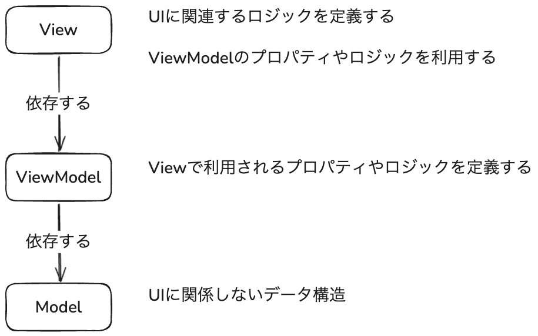

# Model-View-ViewModel (MVVM) パターン


---

## Model-View-ViewModel (MVVM) パターン

<div class="pt-4" />

<Transform :scale="0.8">
  
</Transform>

---
layout: two-cols-header
---

## さきほどの例をViewModelに書き直す

<div class="pt-2" />

<div class="grid grid-cols-2 gap-4">

<div>
```vue {*|1-6|*}
<template>
  <div>
    <p>カウント: {{ counter.count }}</p>
    <button @click="counter.increment">カウントアップ</button>
  </div>
</template>

<script setup lang="ts">
import { reactive } from 'vue'

const vm = reactive(new CounterViewModel())
</script>
```
</div>

<div>
<h4>View</h4>

- `template`タグ内にUIを定義
- ViewModelから提供されたプロパティを利用
- ViewModelから提供された関数を利用

</div>

<div>
```ts
class CounterViewModel {
  public count: number = 0
  
  increment(): void {
    this.count++
  }
}
```
</div>

<div>

<h4>ViewModel</h4>

- プロパティを定義
- 関数を定義

<small>
※ Vueの`reactive`関数非依存にしないと、完全にView非依存とは言えない
</small>

</div>

</div>
