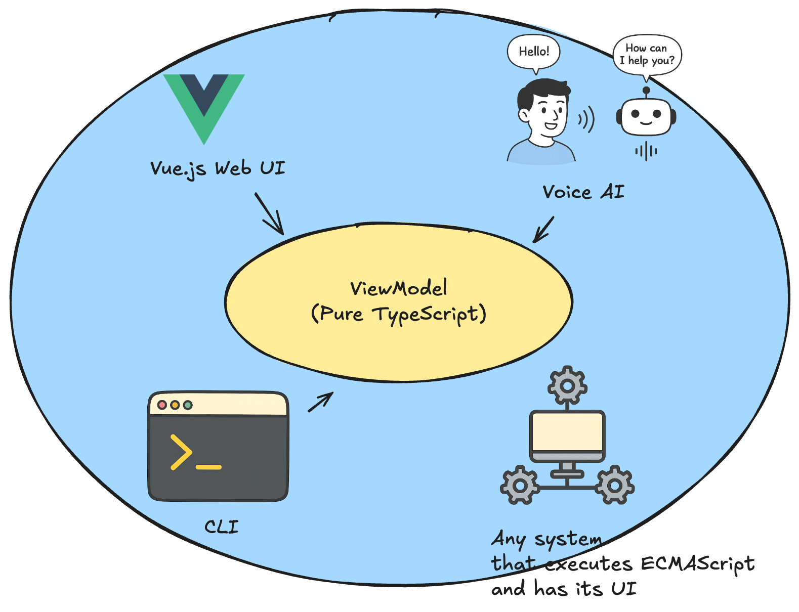

# ViewModelのUI非依存性

---
layout: two-cols-header
---

## WebUIだけがViewじゃない

::left::

以下の特徴を持つものをView (UI) とみなせる

- ユーザーからの入力を読み取れる
- ユーザーに出力を表現できる
- ソフトウェアを実行できる

ViewModelは以下の環境で再利用可能

- WebUI
- CLI
- 音声対話システム
- ロボット
- 上記の特徴を持つものすべて

::right::

---

## デモ: ViewModelの再利用

### ViewModelの再利用

- WebUI (Vue.js)
- 音声対話システム (OpenAI's Realtime API)

[GitHub repository](https://github.com/dopenchills/note-viewmodel-demo-202502)

### 機能

- 認証
- ノート作成・一覧
