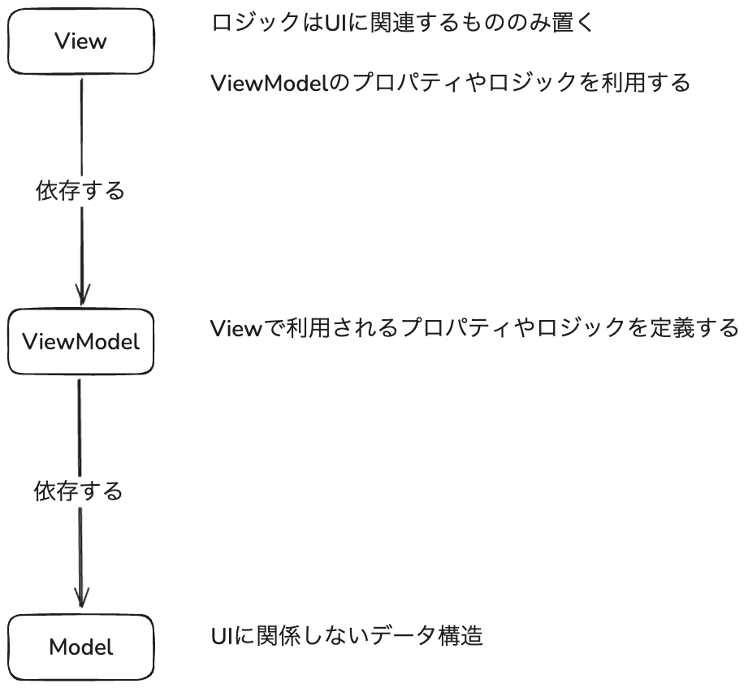
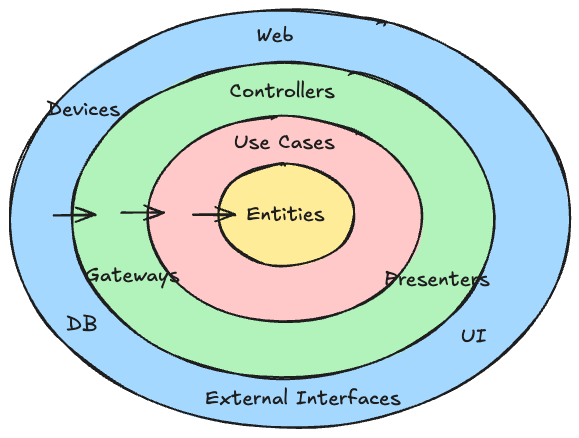
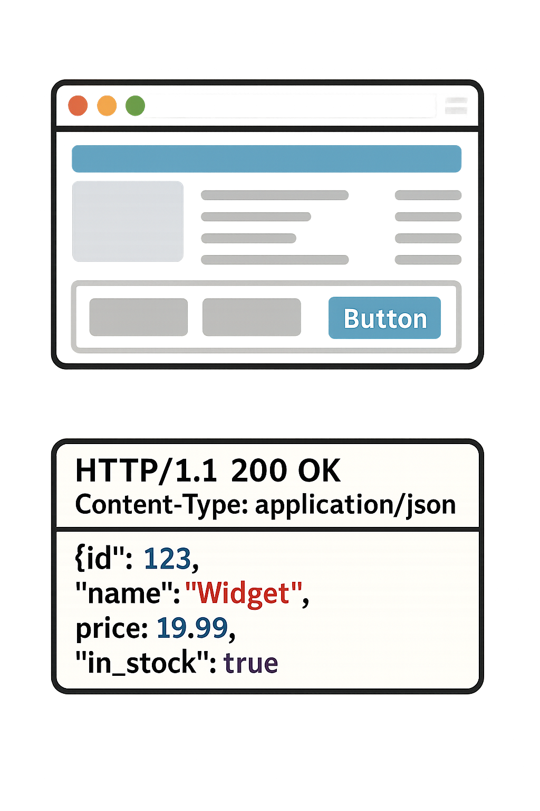

# MVVMと
# クリーンアーキテクチャ

---

## MVVMとクリーンアーキテクチャの関連性

<h4>MVVM</h4>
<Transform :scale="1">
  
</Transform>

<h4>クリーンアーキテクチャ</h4>
<Transform :scale="0.9">
  
</Transform>

両者の共通点：**依存は内側に向かう**

共通原則：**核となるロジックは周辺のロジックに依存しない**

---
layout: section
---

# フロントエンドも
# バックエンドも
# 同じソフトウェア

---

## フロントエンドとバックエンドの共通点

- 入力を受け付ける
- 入力にバリデーションをかける
- 処理を実行する
- 必要に応じて外部システムを利用する
  - 永続化のため
  - 重たい処理のため
  - etc.
- 必要に応じてエラーハンドリングをする
- 出力を返す

**ソフトウェアとしてほとんど同じ**

---

## バックエンドとフロントエンドの主な違い: 入出力

- フロントエンドの入力: ユーザーの行動
- フロントエンドの出力: 新しいUI

- バックエンドの入力: HTTPリクエスト
- バックエンドの出力: HTTPレスポンス

見かけが大きく違うので区別されている。

フロントエンドとバックエンドを全く別のものと考えるより、**入出力が違うだけのソフトウェアとして捉える方が正確**。

---
layout: two-cols-header
---

## 入出力は一番外側のレイヤー

::left::

<Transform :scale="0.75">

</Transform>

::right::

フロントエンドもバックエンドも、依存性管理の原則は同じ：

- 入出力の詳細（UI/API）は外側のレイヤー
- 核となるロジックは内側のレイヤー
- 依存の方向は内側に向かう

核となるロジックの実装はあまり変わらない。

純粋なプログラミングで要件を満たしていける。

- 「ここはDIを使おう」
- 「ここは関数型の考えを使おう」
- etc.

---
layout: section
---

# 疎結合と密結合

---

## フロントエンドとバックエンドを疎結合にする選択

一般的なWeb開発において、フロントエンドとバックエンドは強く結びついてしまいがち。

しかし、フロントエンドをバックエンド非依存にすることで**保守性の高いフロントエンド**を開発できる。

フロントエンドのコードの一部だけを変更することで、別のバックエンドAPIに乗り換えるということも可能になる。

---

## 例: メモアプリの永続化

メモを作成・管理できるフロントエンドアプリを考える。メモは永続化する必要がある。

永続化には以下の選択肢がある:

- 自社のバックエンドAPIを用意する
- DBに直接保存する
- 他社のバックエンドAPIを利用する (Google Drive API等)
- LocalStorage等を使って端末に保存する

**どれか一つにロックインすると、乗り換えにくくなる**

永続化のインターフェースを定義することで、バックエンド非依存にできる。

---

## 逆にあえて密結合にする選択

フロントエンドとバックエンドをあえて密結合にして、OpenAPI関連のツールを利用することで、**開発の高速化**が可能。

**トレードオフ**:
- ✅ 開発速度が向上する
- ❌ 保守性が低下する（特定APIへのロックイン）

「みんなやっているから」ではなく、**トレードオフを理解した上で選択すべき**。

---
layout: section
---

# おまけ

## フロントエンドとバックエンドの役割について

---

## 一般論をそのまま受け入れるのは得策ではない

- フロントエンドの役割は...
- バックエンドの役割は...

フロントエンドとバックエンドが同じソフトウェアであるという視点に立つと、このような一般論を批判的に捉えることができる。

役割は要件によって決まるものであり、一般化は難しい。

---

## 例：バリデーション

- フロントエンド側: UXのためにバリデーションを実装する
- バックエンド側: システムを守るためにバリデーションを実装する

これは必ずしも正確ではない。

**両方とも「正しく動作するための境界防御」という目的を持つ**

---

## 例: 計算機アプリ

計算機アプリにおいて、フロントエンドのバリデーションは正常なシステム動作のために必要。

UXのためではなく、システム防御のため。

| 領域 | バリデーションの目的 | 具体例 |
| --- | --- | --- |
| フロントエンド | ❌ UXのためではない。 ✅ システム保護のため | 数字や記号以外の入力を防ぐ |
| バックエンド (履歴保存など) | ✅ システム保護のため | 誤ったデータ形式を防ぐ |

特にバックエンド非依存のフロントエンドの場合は、システム防御のためにフロントエンドでバリデーションする必要がある。

---

## まとめ: 依存の整理の普遍性

1. MVVMとクリーンアーキテクチャは同じ基本原則に基づいている
   - **依存は内側に向かう**
   - **核となるロジックは周辺のロジックに依存しない**

2. フロントエンドとバックエンドは入出力が異なるだけの同じソフトウェア
   - 同じ設計原則が適用できる

3. フロントエンドとバックエンド間を疎結合にするか密結合にするか
   - 開発速度 vs 保守性

4. フロントエンドとバックエンドの役割は要件によって決まる
