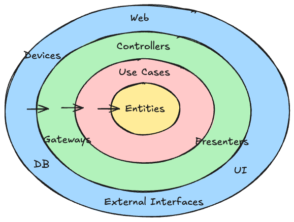

# MVVM and
# Clean Architecture

---

## Relationship between MVVM and Clean Architecture

<h4>MVVM</h4>
<Transform :scale="1">
  
</Transform>

<h4>Clean Architecture</h4>
<Transform :scale="0.9">
  
</Transform>

Commonality: **Dependencies point inward**

Shared principle: **Core logic does not depend on peripheral logic**

---
layout: section
---

# Frontend and
# Backend are
# the Same Software

---

## Commonalities between Frontend and Backend

- Accept input
- Validate input
- Execute processing
- Use external systems as needed
  - For persistence
  - For heavy processing
  - etc.
- Handle errors as needed
- Return output

**They are almost the same as software**

---

## Main difference between Backend and Frontend: Input/Output

- Frontend input: User actions
- Frontend output: New UI

- Backend input: HTTP request
- Backend output: HTTP response

They are distinguished because the appearance is very different.

Rather than thinking of frontend and backend as completely different, it's more accurate to see them as software with different input/output.

---
layout: two-cols-header
---

## Input/Output is the Outermost Layer

::left::

<Transform :scale="0.75">

</Transform>

::right::

Frontend and backend share the same dependency management principles:

- Input/output details (UI/API) are the outer layer
- Core logic is the inner layer
- Dependencies point inward

The implementation of core logic doesn't change much.

You can fulfill requirements with pure programming.

- "Let's use DI here"
- "Let's use functional programming here"
- etc.

---
layout: section
---

# Loose Coupling and Tight Coupling

---

## Choosing Loose Coupling between Frontend and Backend

In typical web development, frontend and backend tend to be tightly coupled.

However, by making the frontend independent of the backend, you can develop a **highly maintainable frontend**.

You can even switch to a different backend API by changing only part of the frontend code.

---

## Example: Note App Persistence

Consider a frontend app that can create and manage notes. Notes need to be persisted.

Persistence options include:

- Prepare your own backend API
- Save directly to a DB
- Use a third-party backend API (e.g., Google Drive API)
- Save to the device using LocalStorage, etc.

**Locking into one makes switching harder**

By defining a persistence interface, you can make the frontend backend-independent.

---

## Choosing Tight Coupling on Purpose

You can also intentionally tightly couple frontend and backend and use OpenAPI tools for **faster development**.

**Trade-off:**
- ✅ Faster development
- ❌ Lower maintainability (locked into a specific API)

Don't just do it because "everyone does it"—make the choice understanding the trade-offs.

---
layout: section
---

# Bonus

## About the Roles of Frontend and Backend

---

## It's Not Wise to Accept Generalizations as Is

- The role of the frontend is...
- The role of the backend is...

If you see frontend and backend as the same software, you can critically examine such generalizations.

Roles are determined by requirements, and generalization is difficult.

---

## Example: Validation

- Frontend: Implements validation for UX
- Backend: Implements validation to protect the system

This is not always accurate.

**Both have the purpose of "boundary defense for correct operation"**

---

## Example: Calculator App

In a calculator app, frontend validation is needed for correct system operation.

Not for UX, but for system defense.

| Area | Purpose of Validation | Example |
| --- | --- | --- |
| Frontend | ❌ Not for UX. ✅ For system protection | Prevent input of non-numeric characters |
| Backend (e.g., for history saving) | ✅ For system protection | Prevent incorrect data formats |

Especially for frontend that is backend-independent, validation on the frontend is needed for system defense.

---

## Summary: Universality of Organizing Dependencies

1. MVVM and Clean Architecture are based on the same basic principles
   - **Dependencies point inward**
   - **Core logic does not depend on peripheral logic**

2. Frontend and backend are the same software with different input/output
   - The same design principles apply

3. Whether to make frontend and backend loosely or tightly coupled
   - Development speed vs. maintainability

4. The roles of frontend and backend are determined by requirements
