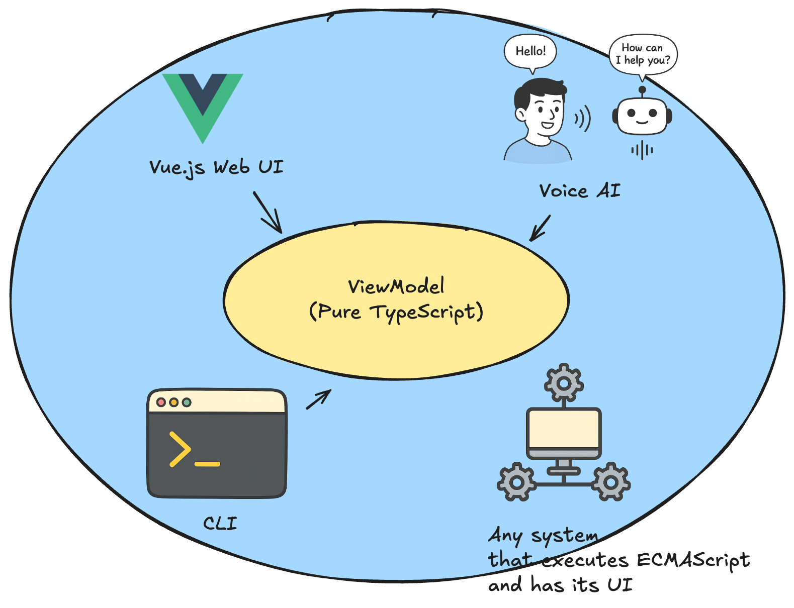

# デモ: ViewModelの移植性

<Transform :scale="0.6">
  
</Transform>

---

# デモ: ViewModelの移植性

同じViewModelを、以下の2つのUIで使い回せることを示す

- WebUI (Vue.js)
- 音声対話UI (OpenAI Realtime API)

[GitHubリポジトリ](https://github.com/dopenchills/note-viewmodel-demo-202502)

---

