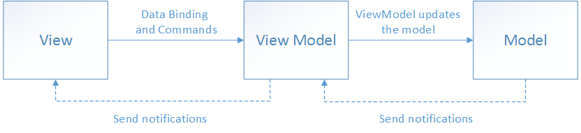

## Model-View-ViewModel (MVVM) パターンによる解決

---
layout: two-cols-header
---

# Model-View-ViewModel (MVVM) パターン

[Reference](https://learn.microsoft.com/ja-jp/dotnet/architecture/maui/mvvm)

::left::

## View

見た目やレイアウトのロジック。

ReactやVueを使ってレンダリングする。

ViewModelに依存する。

::right::

## ViewModel

Viewを制御するロジック。

純粋なTypeScriptのクラスとして実装可能。

Viewに依存しない。

---

# 重要な点

UIに関するロジックと、それ以外のロジックを分離すること。

| ロジックの種類 | レイヤー | 実装方法 |
|-------------|------------|---------|
| UIに関するロジック | View | UIライブラリ (React, Vue, etc.) |
| それ以外のロジック | ViewModel | 純粋なTypeScript |

