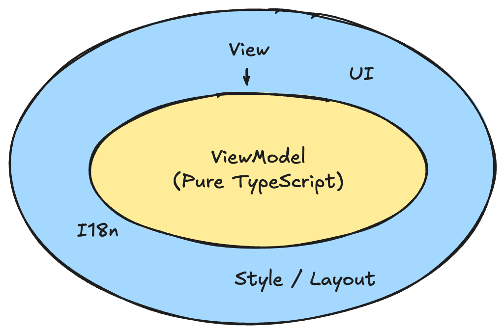

# クリーンアーキテクチャとのアナロジー

::left::

ViewModelはViewに依存しないので、以下の特徴を持つ

- フレームワーク非依存
- テスト可能

クリーンアーキテクチャに従うバックエンドではDBの移行が簡単になる。

同様に、フロントエンドでもUIライブラリの移行が簡単になる。

::right::



---
layout: two-cols-header
---

# ViewはHow, ViewModelはWhat

ViewとViewModelのどちらにロジックを書こうか迷った際、ViewはHow, ViewModelはWhatを書くという考え方ができる。

::left::

```ts {*|10-11|*}
class ProfileViewModel {
  errorKey: I18nKey = ""

  // 中略

  getUser(){
    try {
      const user = this.userService.getUser()
    } catch (error) {
      // 👇 ViewModelでは"何を伝えたいか"を扱う
      this.errorKey = "Errors.Api.Unexpected"
    }
  }
}
```

::right::

```vue {*|3-6,14|*}
<template>
  <div>
    <!-- 👇 Viewでは"どう見せるか"を扱う -->
    <div v-if="vm.errorKey" class="error-message">
      {{ $t(vm.errorKey) }}
    </div>
  </div>
</template>

<script setup lang="ts">
import { useI18n } from 'vue-i18n'
import { reactive } from 'vue'

const { t } = useI18n()
const vm = reactive(new ProfileViewModel())
</script>
```
