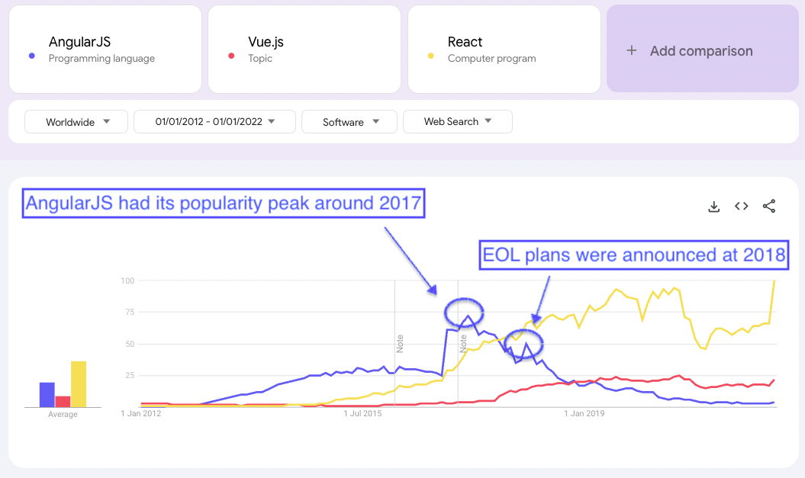

# AngularJS

Googleに支援されたフロントエンド向けWebフレームワーク

当時は双方向データバインディングという考えが新しく、フロントエンド向けWebフレームワークとして人気になった。

---

# AngularJSの人気

[Reference](https://trends.google.com/trends/explore?cat=32&date=2012-01-01%202022-01-01&q=%2Fm%2F0j45p7w,%2Fg%2F11c0vmgx5d,%2Fm%2F012l1vxv&hl=en-GB)

<!-- ピークが2027年ごろにあるということを強調した画像にした方が良さそう -->

---

# AngularJSのEOL

**[2022年をもって公式のサポートが終了した](https://docs.angularjs.org/misc/version-support-status)**

## 移行先

AngularJSの後継であるAngularへの移行が推奨された。

## 移行方法

AngularJSとAngularはほとんど異なるフレームワークであり、書き直しが必要だった。

公式からはAngularJSとAngularを共存させるツールが提供され、徐々に書き直していくアプローチが提案された。

---

# AngularJSからの移行

大きな工数が必要だった

| 会社/プロジェクト | 移行期間 | 移行先 | 備考 | 参照リンク |
|-----------------|---------|-------|------|----------|
| Holistics | 4ヶ月 | Vue.js | | [ブログ記事](https://www.holistics.io/blog/why-and-how-we-migrated-from-angularjs-to-vuejs/) |
| ANDPAD | 8ヶ月 | NuxtJS | | [ブログ記事](https://tech.andpad.co.jp/entry/2021/03/11/170000) |
| NulabのTypeTalk | 62人月 | Angular | | [ブログ記事](https://nulab.com/ja/blog/typetalk/things-we-did-on-angular-migration/) |
| 個人プロジェクト | 2.5年 | Angular | 10万行、1700ファイル | [Medium記事](https://medium.com/@rochat.aurelia/from-angularjs-to-angular-a-2-years-journey-5afcebe050a8) |
| ButterCMS | 3年 | React | | [ブログ記事](https://buttercms.com/blog/migrating-from-angularjs-to-react/) |
