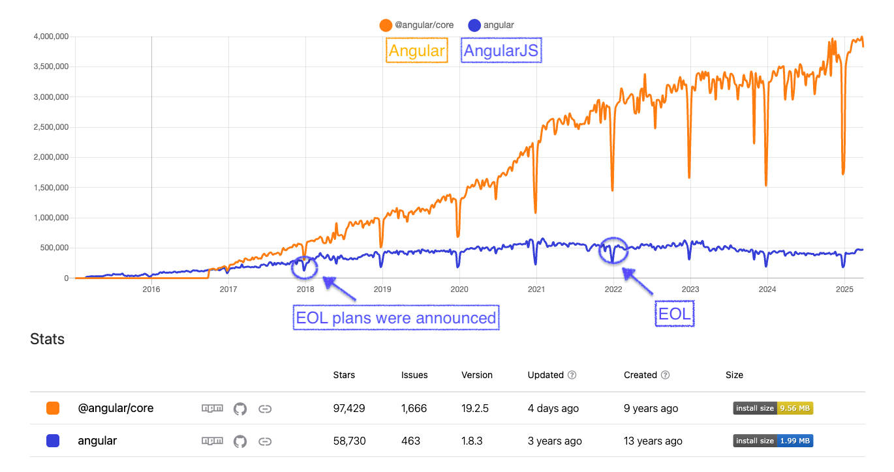

# [AngularJS](https://github.com/angular/angular.js)

Googleが開発したフロントエンドWebフレームワーク。

2010年に開発が開始され、人気になった。

一方でGoogleはTypeScriptベースでのAngular(v2+)も並行して開発し、2016年にリリースした。AngularJSが抱えていたパフォーマンス上の問題も解決するものだった。

結局Angularの方が人気となり、AngularJSのEOLの計画が2018年に発表された。

---
layout: fact
---

---

# [AngularJSのEOL (2022年)](https://docs.angularjs.org/misc/version-support-status)

AngularJSの後継であるAngularへの移行が推奨された。

## 移行方法

AngularJSとAngularはほとんど異なるフレームワークであり、書き直しが必要だった。

公式からはAngularJSとAngularを共存させるツールが提供され、徐々に書き直していくアプローチが提案された。

---

# AngularJSからの移行

書き直しとなるため、別UIフレームワークに移行するプロジェクトもあった。

| 会社/プロジェクト | 移行期間 | 移行先 | 備考 | 参照リンク |
|-----------------|---------|-------|------|----------|
| Holistics | 4ヶ月 | Vue.js | | [ブログ記事](https://www.holistics.io/blog/why-and-how-we-migrated-from-angularjs-to-vuejs/) |
| ANDPAD | 8ヶ月 | NuxtJS | | [ブログ記事](https://tech.andpad.co.jp/entry/2021/03/11/170000) |
| NulabのTypeTalk | 62人月 | Angular | | [ブログ記事](https://nulab.com/ja/blog/typetalk/things-we-did-on-angular-migration/) |
| 個人プロジェクト | 2.5年 | Angular | 10万行、1700ファイル | [Medium記事](https://medium.com/@rochat.aurelia/from-angularjs-to-angular-a-2-years-journey-5afcebe050a8) |
| ButterCMS | 3年 | React | | [ブログ記事](https://buttercms.com/blog/migrating-from-angularjs-to-react/) |
