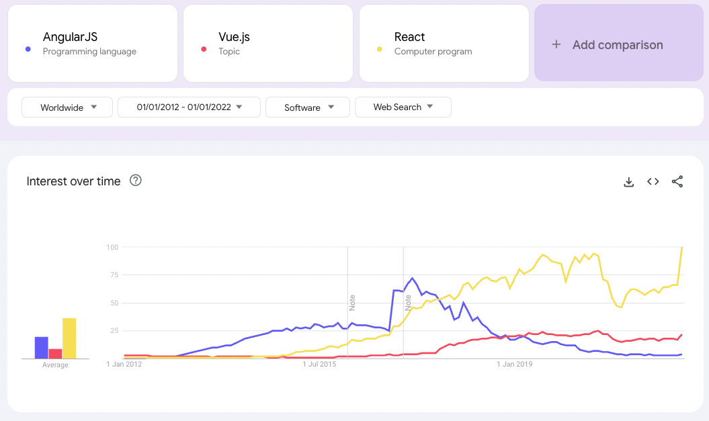

# ViewModelがあなたを救う方法

UIライブラリに依存しない生活

※ UIライブラリ非依存はいい考え方。タイトルもそれっぽくできそう
※ さっきは「MVVMでよいという提案」としたが、もう一回考えたい

---

# フロントエンド開発にありがちなこと

- ライブラリのドキュメンテーションを読む
- ドキュメンテーションを読みながらUIを実装する
- バグの対応をする
- EOLや脆弱性対応等の理由によりライブラリのバージョンアップ・移行対応をする
- ブラウザを使って手作業でテストをする

疑問: これに自分の人生の時間を使いたいだろうか...？

**ビジネスや要件について理解して、ソフトウェアで解決すること**についてもっと時間を使いたい

---

# ライブラリに必要以上に頼っているから

なぜ本質的なことに時間を使えないのか

React, Vue, Redux, Recoil, Vuex, Piniaなどのライブラリを必要以上に使っていると...

→ 開発時にドキュメンテーションを開く必要がある

→ テストが書きにくくなる

→ バージョンアップや移行時の破壊的変更に苦しむ

---

# 悲鳴集

ライブラリのバージョンアップや移行なんて本当に起きるの？

## AngularJS

人気フレームーワークがEOLになった分かりやすい事例

## Recoil

2025年1月、状態管理ライブラリがアーカイブされた事例

---

# AngularJS

Googleに支援されたフロントエンド向けWebフレームワーク

当時は双方向データバインディングという考えが新しく、フロントエンド向けWebフレームワークとして人気になった。

---

# AngularJSの人気

[Reference](https://trends.google.com/trends/explore?cat=32&date=2012-01-01%202022-01-01&q=%2Fm%2F0j45p7w,%2Fg%2F11c0vmgx5d,%2Fm%2F012l1vxv&hl=en-GB)

<!-- ピークが2027年ごろにあるということを強調した画像にした方が良さそう -->

---

# AngularJSのEOL

**[2022年をもって公式のサポートが終了した](https://docs.angularjs.org/misc/version-support-status)**

## 移行先

AngularJSの後継であるAngularへの移行が推奨された。

## 移行方法

AngularJSとAngularはほとんど異なるフレームワークであり、書き直しが必要だった。

公式からはAngularJSとAngularを共存させるツールが提供され、徐々に書き直していくアプローチが提案された。

---
class: text-sm
---
# AngularJSからの移行

大きな工数が必要だった

| 会社/プロジェクト | 移行期間 | 移行先 | 備考 | 参照リンク |
|-----------------|---------|-------|------|----------|
| Holistics | 4ヶ月 | Vue.js | | [ブログ記事](https://www.holistics.io/blog/why-and-how-we-migrated-from-angularjs-to-vuejs/) |
| ANDPAD | 8ヶ月 | NuxtJS | | [ブログ記事](https://tech.andpad.co.jp/entry/2021/03/11/170000) |
| NulabのTypeTalk | 62人月 | Angular | | [ブログ記事](https://nulab.com/ja/blog/typetalk/things-we-did-on-angular-migration/) |
| 個人プロジェクト | 2.5年 | Angular | 10万行、1700ファイル | [Medium記事](https://medium.com/@rochat.aurelia/from-angularjs-to-angular-a-2-years-journey-5afcebe050a8) |
| ButterCMS | 3年 | React | | [ブログ記事](https://buttercms.com/blog/migrating-from-angularjs-to-react/) |

---

# [Recoil](https://github.com/facebookexperimental/Recoil)

Metaによる実験的なReactのための状態管理ライブラリ。

Metaによる人員整理の影響で開発が継続できなくなり、2025年1月にArchiveされた。

状態管理ライブラリはフロントエンドのコードベース全体で使われることが多いため、修正すべきファイル数は多いと想像できる。

---

# Recoilからの移行

Xの反応

<SlidevVideo autoplay controls>
  <source src="./pages/AngularJS/.videos/Recoil Migration on X.webm" type="video/webm" />
</SlidevVideo>

---

# ではどうすればいいのか

フロントエンドエンジニアは外部要因によって何年も移行作業をする必要が出てくる可能性がある。

全てを.vueファイルで記述していると、Vue.jsがEOLしたときに会社のフロントエンド資産を全て移行する必要が出てくる。

## MVVMパターンの導入

- UIライブラリにはUIのレンダリングだけさせる
- 状態管理ライブラリは使わず、単純なTypeScriptのクラスに置き換える

---
layout: two-cols-header
---

# MVVMパターン

::left::

## View

見た目やレイアウトのロジック。

モダンなフロントエンド開発では、ReactやVueのコンポーネントを使ってUIレンダリングを行うことが多い。

::right::

## ViewModel

Viewをコントロールするロジック。

Viewに変更を通知したり、Viewからユーザーの入力を受け取ったりする。

純粋なTypeScriptのクラスとして実装可能。

## 重要な点

フロントエンド上で、UIに関するロジック(View)と、それ以外のロジック(ViewModel)に分離すること。

ViewModelはTypeScriptのクラスとして記述する。

---

